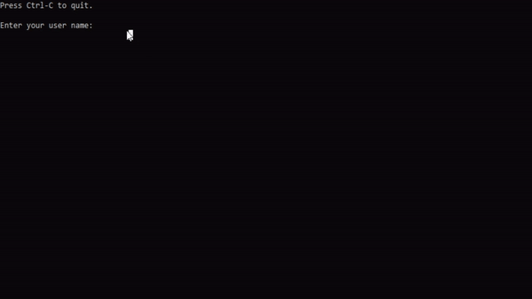

# StarlimsAutoTest 

StarlimsAutoTest is a python script to automate the workflow, from start to finish, of Starlims V11 tests. The main process includes login, receive in lab, create run, add samples to run, add results to run (including processing triggers), finalize run, release by panel, send to printer.  

<p align="center">

</p>

## Installation

#### Setup
  - Create a folder to hold StarlimsAutoTest.py and get-pip.py
#### Python 3
  - Download python 3 for windows 10: https://www.python.org/downloads/release/python-380/
  - You want the "Windows x86-64 executable installer"
  - Enable option "Add Python 3.8 to PATH"
  - Enable option to bypass the 260 character limit
#### Pip
  - Go to URL: https://bootstrap.pypa.io/get-pip.py
  - Right-click, save as - save in the previously created python folder
  - Open command prompt in the python folder, run ```pip install foobar```
#### Pyautogui
  - Open command prompt in the python folder, run ```pip install pyautogui```
#### Visual Studio C++ Build Tools
  - This is required for Pyodbc
  - Download installer: https://visualstudio.microsoft.com/thank-you-downloading-visual-studio/?sku=BuildTools&rel=16
  - Select the C++ Build Tools option, install
  - Restart computer when prompted
#### Pyodbc
  - Open command prompt in the python folder, run ```pip install pyodbc```
#### Visual Studio
  - 1st recommended editor for python files, specifically for the github linking
#### Notepad++
  - 2nd recommended editor for python files for basic editing

## Usage
- This script assumes a dual monitor 1920 x 1080 screen resolution.
- Have Starlims V11 open, on your primary monitor, and logged in to the dashboard.
- On your second monitor, open the command prompt in the python folder. Run ```python StarlimsAutoTest.py```and continue following the prompt.
